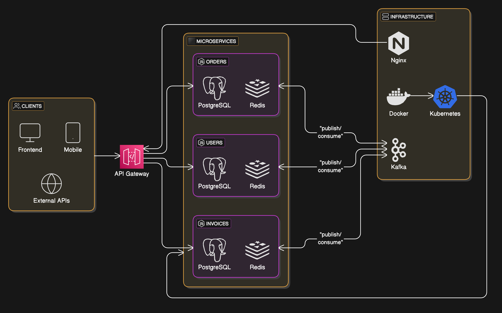
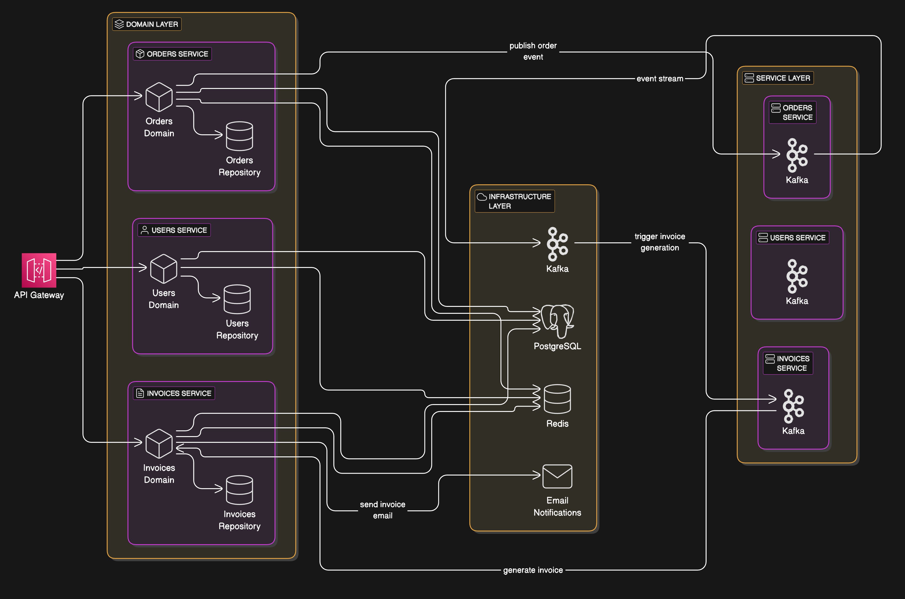

# Project Overview

##### This Node.js application is built using a microservices architecture, designed for scalability, modularity, and maintainability. It uses TypeScript for strong typing and integrates key technologies such as ExpressJS, PostgreSQL, Redis, Apache Kafka, REST APIs, and Docker to ensure optimal performance and flexibility in scaling individual services. The application applies multiple design patterns and software engineering principles to promote clean, maintainable, and testable code.

---

# 📖 Table of Contents

1. Features
2. Architecture Overview
3. Interaction Flow in Microservices and Architecture
4. Domain-Driven Design Principles and Patterns
5. Design Patterns
6. Principles
7. Technologies
8. Getting Started
9. Project Structure
10. API Documentation
11. Running the Application
12. Running Tests
13. Usage
14. Contributing
15. License

---

# ✨ Features

## Order Management
* **Order Creation and Lifecycle Management**
  * Creates orders with initial PENDING status with user association
  * Uses distributed transactions to ensure data consistency across services
  * Supports order approval flow with automatic invoice generation
  * Handles order cancellation with compensation actions
  * Publishes events on state changes via Kafka

* **Order Retrieval and Querying**
  * Fetches paginated lists of orders with filtering and sorting options
  * Optimizes data retrieval with Redis caching
  * Implements DataLoader pattern for efficient batch loading
  * Provides order details with associated user information

## Invoice Management
* **Invoice Generation and Processing**
  * Automatically generates invoices as part of order approval process
  * Maintains invoice status synchronized with order status
  * Uses transaction coordinator to ensure data consistency
  * Supports compensation mechanisms for failed transactions

* **Invoice Retrieval and Querying**
  * Provides APIs to retrieve invoice details with related order and user data
  * Implements caching for performance optimization
  * Supports filtering and pagination

## User Service
* **User Management**
  * Manages user accounts and profile information
  * Handles user authentication and authorization
  * Associates users with roles for permission management
  * Validates data integrity (unique email, password requirements)

* **Role-Based Access Control**
  * Manages user permissions through role assignments
  * Secures endpoints based on user roles
  * Provides role management capabilities

## Distributed Transaction Management
* **Saga Pattern Implementation**
  * Coordinates multi-step transactions across microservices
  * Implements compensation mechanisms for failed transactions
  * Maintains transaction state in Redis for reliability
  * Provides transaction monitoring and status tracking

* **Event-Driven Communication**
  * Uses Kafka for reliable event publishing and consumption
  * Implements event-based service communication
  * Ensures loose coupling between services

## Resilience and Performance
* **Caching Strategy**
  * Implements Redis caching for frequently accessed data
  * Uses cache invalidation strategies to maintain data consistency
  * Optimizes query performance with selective caching

* **Error Handling and Recovery**
  * Implements retry mechanisms for transient failures
  * Provides detailed error reporting and logging
  * Ensures graceful degradation during partial system failures

## Future Enhancements
* Email notifications for order approvals, cancellations, and user account actions
* Enhanced monitoring and alerting capabilities
* Performance dashboard for real-time system metrics
* Enhanced security features (2FA, OAuth integration)

---

# 🏗 Architecture Overview



---

#### This application follows a microservices architecture where each core business function (Order Management, User Management, etc.) is handled by an independent service. This ensures better scalability, fault isolation, and maintainability.

* Microservices: Each business domain (Orders, Users, Invoices) is isolated into its own service, allowing independent scaling and development.
* Modular Design: Each service follows clear boundaries and can be developed/deployed independently.
* Event-Driven Communication: Services interact asynchronously via Kafka events (e.g., order creation, user updates).
* Asynchronous Processing: Redis is used for caching and message queues, ensuring non-blocking operations.
* Load Balancing: The system scales horizontally using Docker, Kubernetes, and Nginx.

---

# 🧩🔄⚙️🌐 Interaction Flow in Microservices




---

## 1. Domain Layer:

* Houses the core business logic for each microservice (Orders, Users, Invoices).
* Encapsulates operations like changing order statuses, creating users, and generating invoices.

## 2. Service Layer:

* Handles interactions between the domain logic and infrastructure.
* Uses repositories for data persistence and Kafka for event-driven communication.

## 3. Infrastructure Layer:

* Manages PostgreSQL, Redis, Kafka, and email notifications.
* Redis is leveraged for caching frequently accessed data.

## 4. API Gateway:

* Routes client requests to the appropriate microservice.
* Can aggregate responses from multiple services, reducing client complexity.

## 5. Event-Driven Communication:

* Kafka publishes and consumes events for system-wide updates.
* Example: When an order is approved, a Kafka event triggers the invoice generation process.

---

# ⚙️ Domain-Driven Design Principles and Patterns

* REST API with ExpressJS & TypeScript
* PostgreSQL with ORM for database management
* Redis for caching and queue management
* Dependency Injection using typedi
* Event-driven architecture with Kafka for inter-service communication
* Microservices architecture for scalability
* Robust Logging & Monitoring
* Unit & E2E Testing for reliability
* Security Best Practices
* Scalable & Maintainable Codebase

---

# 🧩⚙️🛠️📐 Design Patterns

##### The following design patterns have been applied to the system to ensure modularity, flexibility, and scalability:

## 1. Singleton Pattern
* Used for managing database connections and Redis cache instances
* Ensures single instances of service connections (Kafka, Redis, PostgreSQL)
* Implemented in infrastructure services to prevent duplicate resources

## 2. Factory Pattern
* Encapsulates object creation in the Container system
* Enables dynamic service instantiation based on configuration
* Used for creating repository instances and data access objects

## 3. Dependency Injection (DI)
* Uses TypeDI to inject dependencies across services
* Reduces coupling between components
* Simplifies testing through mock injection
* Implemented throughout the codebase to manage service dependencies

## 4. Observer Pattern
* Implemented via Kafka event system for real-time updates
* Services subscribe to relevant events and react accordingly
* Used for propagating changes across microservices

## 5. Strategy Pattern
* Allows dynamic switching between querying strategies
* Used in data access layer to support different query patterns
* Supports flexible filtering and sorting mechanisms

## 6. Command Pattern
* Encapsulates operations as objects
* Implements transaction steps as atomic commands
* Used in distributed transaction management

## 7. Decorator Pattern
* Adds cross-cutting concerns without modifying core functionality
* Used for Redis caching (@RedisDecorator)
* Implements event publishing decorators for Kafka messages

## 8. Proxy Pattern
* Implements service proxies for API gateway routing
* Provides caching and rate-limiting for API calls
* Controls access to underlying services

## 9. Repository Pattern
* Abstracts database access behind clean interfaces
* Separates domain models from data access logic
* Used consistently across all services

## 10. Builder Pattern
* Constructs complex objects with clear, step-by-step processes
* Used for building invoice and order objects
* Simplifies object creation with many dependencies

## 11. Publisher-Subscriber Pattern
* Implemented via Kafka for asynchronous messaging
* Enables event-driven architecture
* Decouples services through message passing

## 12. Circuit Breaker Pattern
* Prevents cascading failures across microservices
* Implements retry logic with exponential backoff
* Used in service communication to handle transient failures

## 13. Adapter Pattern
* Creates compatible interfaces between different components
* Used to integrate external services and libraries
* Provides consistent abstractions over infrastructure services

## 14. Saga Pattern
* Coordinates distributed transactions across services
* Implements compensating transactions for failure scenarios
* Maintains transaction state and handles recovery
* Core pattern for ensuring data consistency in the microservice architecture

## 15. Façade Pattern
* Provides simplified interfaces to complex subsystems
* Used in API layer to simplify client interactions
* Hides implementation details of underlying services

## 16. Service Layer Pattern
* Defines application's boundary and API set for client access
* Encapsulates business logic implementation details
* Coordinates responses to client operations with domain operations

## 17. Specification Pattern
* Used for complex querying with composable filter criteria
* Supports advanced search and filtering operations
* Implemented in repository query methods

---

# 📏🧭💡⚖️ Principles

##### This project follows key software design principles to ensure a robust and maintainable codebase:

## 1. SOLID Principles

* Single Responsibility Principle (SRP): Each class and module has a single responsibility, minimizing changes and complexity.
* Open/Closed Principle (OCP): Classes and modules are open for extension but closed for modification, enabling easier feature additions without breaking existing functionality.
* Liskov Substitution Principle (LSP): Derived classes can be used in place of their base classes without altering the correctness of the program.
* Interface Segregation Principle (ISP): Clients should not be forced to depend on interfaces they do not use. This helps in creating smaller, specialized interfaces.
* Dependency Inversion Principle (DIP): High-level modules should not depend on low-level modules. Both should depend on abstractions, which is achieved through DI.

## 2. DRY (Don't Repeat Yourself)

* The codebase ensures that redundant logic and code are minimized. Reusable components and functions are created for common tasks such as error handling, logging, and validation.

## 3. KISS (Keep It Simple, Stupid)

* The application follows a simple and clear architecture, avoiding unnecessary complexity in both the design and implementation. We favor simplicity and readability.

## 4. YAGNI (You Aren't Gonna Need It)

* Only essential features and functionality are implemented. The project avoids overengineering, focusing on the current requirements.

## 5. Separation of Concerns

* The project ensures that business logic, data access, and presentation are separated. Each module is responsible for a specific concern, promoting modularity and maintainability.

## 6. Composition Over Inheritance

* The project favors composing objects and reusing behavior through composition rather than relying heavily on inheritance.

---

# 💻 Technologies

## Backend Core
* **Node.js** - JavaScript runtime environment
* **TypeScript** - Typed superset of JavaScript for better development experience
* **Express.js** - Web framework for building APIs
* **routing-controllers** - Controller-based routing framework

## Database & Storage
* **PostgreSQL** - Relational database for persistent storage
* **TypeORM** - Object-Relational Mapping for database interactions
* **Redis** - In-memory data store for caching and distributed state

## Messaging & Event-Driven Architecture
* **Apache Kafka** - Distributed event streaming platform
* **KafkaJS** - Kafka client library for Node.js

## Dependency Management
* **TypeDI** - Dependency injection container for TypeScript
* **DataLoader** - Batching and caching for database queries

## Containerization & Deployment
* **Docker** - Containerization platform
* **Docker Compose** - Multi-container Docker applications
* **Nginx** - Load balancing and API gateway routing in production

## Authentication & Security
* **Passport.js** - Authentication middleware
* **JSON Web Tokens (JWT)** - Secure information transmission
* **bcrypt** - Password hashing

## Testing & Quality Assurance
* **Jest** - Testing framework
* **eslint** - Code linting for quality control
* **class-validator** - Runtime type checking and validation

## Resilience & Performance
* **Circuit Breakers** - Preventing cascading failures
* **Connection Pooling** - Optimizing database connections
* **Rate Limiting** - Protecting services from overload

---

# 🚀 Getting Started

## 1. Prerequisites

### For Docker Usage

* Install Docker Desktop and ensure it is running.

### For Application Usage

* ✅ Node.js (v23.x or higher)
* ✅ TypeScript
* ✅ PostgreSQL
* ✅ Redis
* ✅ Kafka
* ✅ Docker & Kubernetes
* ✅ yarn

---

## Installation

## 1. Clone the repository:

```javascript
git clone git@github.com:yavarguliyev/invoice_hub_microservices.git
```

## 2. Set Up Environment: 

#### The Docker setup is located at {main_root}/deployment/dev. For managing containers, we do not use the docker-compose up -d command directly. Instead, we use specific scripts to handle the container lifecycle.

#### 1. To start the containers:

```javascript
bash start.sh
```

#### 2. To stop the containers:

```javascript
bash stop.sh
```

#### 3. To remove the containers, images, and volumes:

```javascript
bash remove.sh 
```

## Environment Configuration

* The .env file located in {main_root}/deployment/dev/.env is required for configuration.
* You can copy the example file (.env.example) to create your own .env file.

## 3. Install dependencies:

```javascript
yarn add
```

## 4. Run Migrations:

##### Run migrations:

```javascript
yarn mup
```

##### Revert migrations:

```javascript
yarn mdn
```

##### Copy the .env.example file to .env and fill in the appropriate values for your environment.

---

# 📂 Project Structure

```javascript
/api-gateway             # API gateway for routing requests to microservices
/common                  # Shared utilities, configs, and common code
  ├── /src
     ├── /application    # Application bootstrap and IoC helpers
     ├── /core           # Core configs, middlewares, and types
     ├── /domain         # Domain enums, interfaces, and types
     ├── /infrastructure # Infrastructure implementations (DB, Kafka, Redis)
/deployment              # Deployment configurations
  ├── /dev               # Development environment setup
  ├── /prod              # Production environment configs with Nginx
/services                # Individual microservices
  ├── /auth-service      # Authentication and user management
  ├── /invoice-service   # Invoice operations and management
  ├── /order-service     # Order creation and processing
/package.json            # Workspace definitions and scripts
/README.md               # Project documentation
```

Each service follows a similar structure:

```javascript
/services/<service-name>
  ├── /src
     ├── /api            # REST API controllers and routes
     ├── /application    # Service-specific application logic
        ├── /helpers     # Helper functions and utilities
        ├── /kafka       # Kafka event handlers and subscribers
        ├── /services    # Core business services
        ├── /transactions # Distributed transaction managers
     ├── /domain         # Domain entities and repositories
        ├── /entities    # TypeORM entities
        ├── /repositories # Repository interfaces and implementations
     ├── /test           # Unit and integration tests
  ├── package.json       # Service-specific dependencies
```

---

# 📚 API Documentation

## Documentation Access
* API documentation is available through Swagger UI when running the application:
  * Auth Service: `http://localhost:4001/api-docs`
  * Invoice Service: `http://localhost:4002/api-docs`
  * Order Service: `http://localhost:4003/api-docs`

## Testing with Postman
* A Postman collection file is provided for testing the API endpoints:
  ```
  /postman/invoice_hub_microservices.postman_collection.json
  ```
* Import this collection into Postman to easily test all available endpoints
* The collection includes environment variables for easy configuration

## API Structure
* All APIs follow a consistent RESTful structure
* Endpoints are versioned (e.g., `/api/v1/orders`)
* Standard HTTP methods are used (GET, POST, PATCH, DELETE)
* Responses follow a consistent format with status codes and meaningful messages

# 🚀 Running the Application

## Development Mode

To start the application in development mode:

1. First, start the infrastructure services using Docker:
   ```bash
   cd deployment/dev
   bash start.sh
   ```

2. Start each microservice in development mode (in separate terminals):
   ```bash
   # From the project root
   cd services/auth-service
   yarn start
   
   cd services/invoice-service
   yarn start
   
   cd services/order-service
   yarn start
   
   cd api-gateway
   yarn start
   ```

3. The services will be available at:
   * API Gateway: http://localhost:3000
   * Auth Service: http://localhost:4001
   * Invoice Service: http://localhost:4002
   * Order Service: http://localhost:4003

## Production Mode

For production deployment:

1. Build all services:
   ```bash
   yarn build
   ```

2. Start the production stack:
   ```bash
   cd deployment/prod
   docker-compose up -d
   ```

3. Access the application at: http://localhost

# 🧪 Testing

## Running Tests

To run unit tests for all services:
```bash
yarn test
```

To run tests for a specific service:
```bash
cd services/auth-service
yarn test

cd services/invoice-service
yarn test

cd services/order-service
yarn test
```

# 🛠 Usage

## Authentication

### Login to get JWT token
```bash
curl -X POST {{URL}}/auth/api/v1/auth/login \
  -H "Content-Type: application/json" \
  -d '{
    "email": "admin@example.com",
    "password": "Password123"
  }'
```

### Response:
```json
{
  "result": "SUCCESS",
  "token": "eyJhbGciOiJIUzI1NiIsInR5cCI6IkpXVCJ9...",
  "expiresIn": 3600
}
```

## Order Management

### Create a new order
```bash
curl -X POST {{URL}}/orders/api/v1/orders \
  -H "Content-Type: application/json" \
  -H "Authorization: Bearer YOUR_TOKEN" \
  -d '{
    "totalAmount": 180.20,
    "description": "Monthly office supplies"
  }'
```

### Get list of orders
```bash
curl -X GET {{URL}}/orders/api/v1/orders?page=1&limit=10 \
  -H "Authorization: Bearer YOUR_TOKEN"
```

### Get order details
```bash
curl -X GET {{URL}}/orders/api/v1/orders/{{id}} \
  -H "Authorization: Bearer YOUR_TOKEN"
```

## Invoice Management

### Get list of invoices
```bash
curl -X GET {{URL}}/invoices/api/v1/invoices?page=1&limit=10 \
  -H "Authorization: Bearer YOUR_TOKEN"
```

### Get invoice details
```bash
curl -X GET {{URL}}/invoices/api/v1/invoices/{{id}} \
  -H "Authorization: Bearer YOUR_TOKEN"
```

## User Management

### Get list of users
```bash
curl -X GET {{URL}}/auth/api/v1/users?page=1&limit=10 \
  -H "Authorization: Bearer YOUR_TOKEN"
```

### Get user details
```bash
curl -X GET {{URL}}/auth/api/v1/users/{{id}} \
  -H "Authorization: Bearer YOUR_TOKEN"
```

## Working with Filters

You can add filters to list endpoints:

```bash
curl -X GET {{URL}}/orders/api/v1/orders?page=1&limit=10&filters[status]=PENDING \
  -H "Authorization: Bearer YOUR_TOKEN"
```

---

# 🤝 Contributing

1. Fork the repository.
2. Create a new branch (git checkout -b feature-name).
3. Commit your changes (git commit -am 'Add new feature').
4. Push to the branch (git push origin feature-name).
5. Create a new Pull Request.

---

# 📝 License

#### This project is licensed under the MIT License. See the [LICENSE](https://github.com/yavarguliyev/invoice_hub_microservices/blob/master/LICENSE) file for details.
